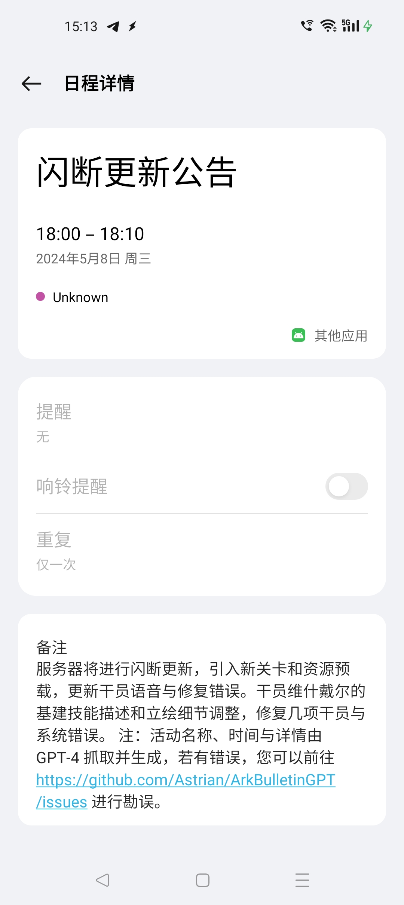

# ArkBulletinGPT

利用 GPT 总结《明日方舟》国服相关公告、读取《明日方舟》国服活动日程表。

## 活动公告

利用 Telegram 发布。

示例输出：

```
新游戏内公告：https://telegra.ph/危机合约12赛季起源行动即将开启-03-29-8
省流：明日方舟公告：
1. 危机合约#12赛季「起源行动」开启，时间为03月21日 16:00 - 04月04日 03:59，解锁条件为通关主线 2-10；跨赛季“机密圣所”开放，可兑换高级养成素材、模组养成材料、龙门币、家具零件、作战记录、职业芯片等素材。
2. 【联合行动】特选干员定向寻访开启，时间为03月21日 16:00 - 04月04日 03:59，6星和5星干员出率分别为2%和8%。
3. “资源收集”关卡限时全天开放，时间同为03月21日 16:00 - 04月04日 03:59。
#活动通知
```

## 日历订阅

在各大操作系统内置或第三方的日历 app 中，订阅地址 `https://arkbulletingpt.astrian.moe/arknights_events.ics`，就可以订阅《明日方舟》国服活动日程表。



大部分情况下，日程表由 GPT-4 生成。如有错误，欢迎通过 issue 提出。
